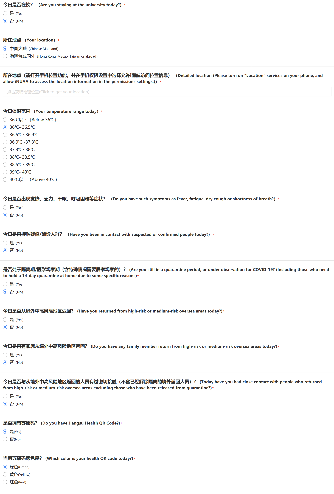
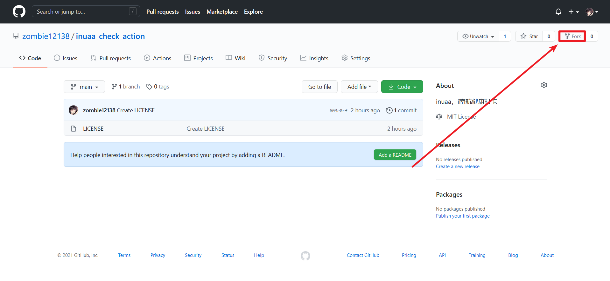
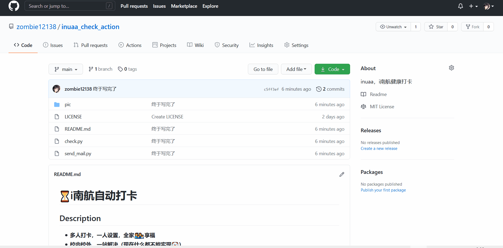
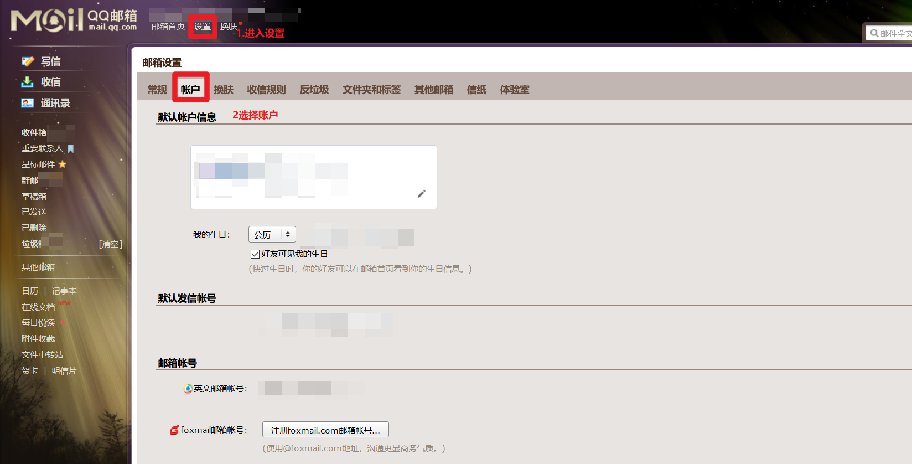
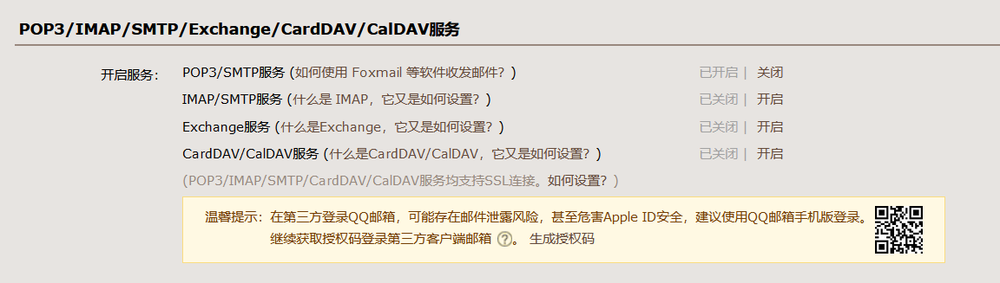
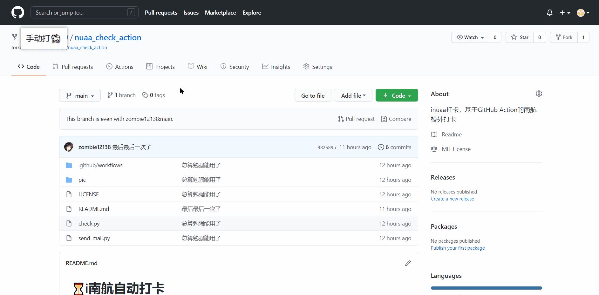
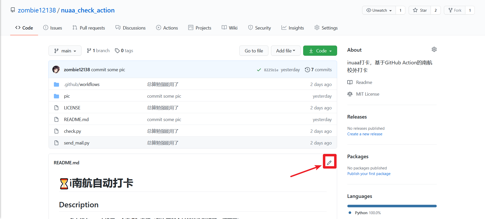
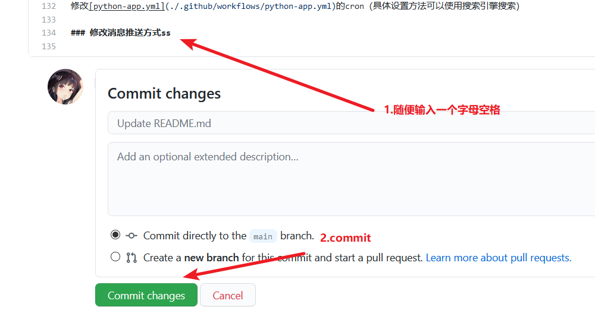

# ⏳i南航自动打卡

## Description

- **多人打卡，一人设置，全家👨‍👨‍👦‍👦享福**
- **校外打卡，无需抓包**
- **基于GitHub Action**
- **邮箱通知📧**

**免责声明：本项目仅仅可以学习研究，请遵守校内纪律和相关法规。如果出现信息错误等后果概不负责。**

本项目以 MIT 协议开源，详情请见 [LICENSE](./LICENSE) 文件。

有问题可以提出issue与我🤺。

## Q&A

**Q:** 打卡的默认选项是什么?  
**A:** 默认选项为一切正常并且素康🐎为绿色💚，从浏览器抓的包，想自己抓用Fiddler或者BurpSuite。可以通过访问打卡页面获取之前的选项，但是太懒了，还没有做。



**Q:** 哪个网页里抓的包？  
**A:** <https://m.nuaa.edu.cn/ncov/wap/default>，校外打卡；<https://m.nuaa.edu.cn/ncov/wap/nuaa/index>，校内打卡。其中位置信息从<https://restapi.amap.com/v3/geocode/regeo?key=729923f88542d91590470f613adb27b5&s=rsv3&location=经度,纬度>获取。

**Q:** 为什么要用邮箱通知而不用Server酱之类的？  
**A:** 因为室友们实在太懒了，而且发给QQ邮箱效果也不错。

**Q:** 为什么要使用Github Action？  
**A:** 我也感觉如果用于打卡的话确实不好用。

**Q:** 我如何知道自己的经纬度？  
**A:** 由于上报定位使用高德地图的API，建议使用高德坐标拾取器更加准确<https://lbs.amap.com/console/show/picker>。

## Usage

### Step.1 Fork

点击右上角Fork，Fork至自己的仓库



### Step.2 设置Secrets

设置Secrets，新建secret字段 **config**



这是一个代表打卡信息的Json，

字段说明

|  KEY   | 作用  |
|  ----  | ----  |
| mail_sender  | 使用该邮件地址发送邮件提醒 |
| smtp_password  | 邮件smtp的密码，不同于邮箱密码，请登录邮箱进行设置 |
|  students  |  收件人列表，可以一人或多人  |
|  stu_number  |  打卡学生的学生id  |
|  password  | 打卡学生教务密码  |
|  mail  | 打卡学生的收信箱，用于接收打卡提示  |
|  latitude  | 经度，**为数值不是字符串**，通过高德地图获取的，具体获取见QA  |
|  longitude  | 纬度，**为数值不是字符串**，通过高德地图获取的，具体获取见QA  |

students里面的stu_number、mail和经纬度是必须的，mail至少明确给出空值。  
**如果不需要邮件提醒，就把所有邮件相关的值都设置为空；如果某个人不需要邮件提醒则把这个人的收信箱设置为空。**

举个🌰吧叭

下面的082010103学号同学不会收到邮件

``` json
{
    "mail_sender": "666666@qq.com",
    "smtp_password": "aaaaaaaaaaaaaaaa",
    "smtp_host": "smtp.qq.com",
    "students": [
        {
            "stu_number": "082010101",
            "password": "St13456",
            "mail": "666666@qq.com",
            "latitude": 39.5655665,
            "longitude":114.0484894
        },
        {
            "stu_number": "082010103",
            "password": "St13456",
            "mail": "",
            "latitude": 33.5655665,
            "longitude":115.0484894
        }
    ]
}
```

下面的🌰中，都不会收到邮件。  
**注意：收件人可以为空，但不能不写。收件人全都为空，则发件人相关的可以不写（如下所示）**

``` json
{
    "students": [
        {
            "stu_number": "082010101",
            "password": "St13456",
            "mail": "",
            "latitude": 39.5655665,
            "longitude":114.0484894
        },
        {
            "stu_number": "082010103",
            "password": "St13456",
            "mail": "",
            "latitude": 33.5655665,
            "longitude":115.0484894
        }
    ]
}
```

QQ邮箱smtp密码获取如下：


然后下面选择开启pop3/smtp服务，得到smtp密码


### Step.3 开启Action

点击你的项目中的Action，开启Action；然后选择Check，点击`enable workflow`



### Step.4 测试

push打卡测试一下



如果成功就可以每天00：00打卡（准确时间会是00：45左右，任务会有的延迟）🌶

## Advancement

### 修改打卡时间

修改[python-app.yml](./.github/workflows/python-app.yml)的cron（具体设置方法可以使用搜索引擎搜索）

### 修改消息推送方式ss 
